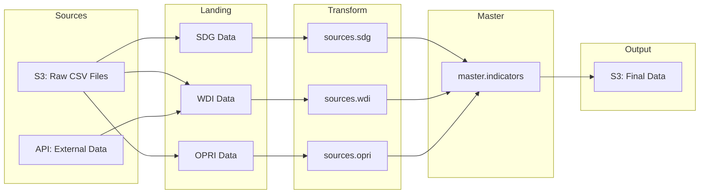

# OSAA Data Pipeline - Data Catalog

*Generated on: 2025-10-02 08:05:43*

## Executive Summary

The OSAA Data Pipeline processes and integrates multiple data sources to support 
sustainable development monitoring and analysis. This catalog documents all 
datasets, their structures, relationships, and usage patterns.

- **Total Datasets**: 6
- **Data Sources**: SDG (UN), WDI (World Bank), OPRI, EDU
- **Update Frequency**: Daily
- **Primary Use Cases**: SDG monitoring, development indicators analysis, policy research

## Table of Contents

1. [Dataset Inventory](#dataset-inventory)
2. [Column Dictionary](#column-dictionary)
3. [Data Lineage](#data-lineage)
4. [Usage Examples](#usage-examples)
5. [Data Quality Standards](#data-quality-standards)
6. [Contact Information](#contact-information)

## Dataset Inventory

### _metadata.all_models

**Description**: Table containing all_models data

| Property | Value |
|----------|--------|
| Schema | `_metadata` |
| Table | `all_models` |
| Update Frequency | Daily |
| SLA | 24 hours |
| Owner | UN-OSAA Data Team |

**Columns**:

| Column | Type | Nullable | Description |
|--------|------|----------|-------------|
| `model_name` | String | Yes |  |
| `model_description` | String | Yes |  |
| `model_kind` | String | Yes |  |
| `grain` | String | Yes |  |
| `columns` | String | Yes |  |
| `column_descriptions` | String | Yes |  |
| `physical_properties` | String | Yes |  |

**Sample Queries**:

```sql
-- Select all records
SELECT * FROM _metadata.all_models LIMIT 10;
```

---

### master.indicators

**Description**: Unified master table combining all indicator sources into a single comprehensive dataset.

| Property | Value |
|----------|--------|
| Schema | `master` |
| Table | `indicators` |
| Update Frequency | Daily |
| SLA | 24 hours |
| Owner | UN-OSAA Data Team |
| Grain | source, indicator_id, country_id, year |

**Data Source Information**:

- **Dataset Owner**: UN-OSAA Data Team
- **Maintenance Status**: Actively Maintained
- **Update Cadence**: Daily
- **Transformations Of Raw Data**: Union of all source indicators with source tracking

**Columns**:

| Column | Type | Nullable | Description |
|--------|------|----------|-------------|
| `indicator_id` | String | Yes | Unique indicator identifier (varies by source) |
| `country_id` | String | Yes | ISO 3166-1 alpha-3 country code |
| `year` | Int64 | Yes | Reference year for the data point |
| `value` | Decimal | Yes | Numeric value of the indicator |
| `magnitude` | String | Yes | Scale or unit of measurement |
| `qualifier` | String | Yes | Data quality or status notes |
| `indicator_description` | String | Yes | Human-readable indicator description |

**Sample Queries**:

```sql
-- Select all records
SELECT * FROM master.indicators LIMIT 10;
```

```sql
-- Get latest year data
SELECT * FROM master.indicators
WHERE year = (SELECT MAX(year) FROM master.indicators);
```

```sql
-- Get data for specific country
SELECT * FROM master.indicators
WHERE country_id = 'USA';
```

```sql
-- Get specific indicator data
SELECT * FROM master.indicators
WHERE indicator_id LIKE '1.%';
```

---

### sources.opri

**Description**: OPRI (Operational Performance and Risk Indicators) data for institutional performance monitoring.

| Property | Value |
|----------|--------|
| Schema | `sources` |
| Table | `opri` |
| Update Frequency | Monthly |
| SLA | 24 hours |
| Owner | UN-OSAA Operations Team |
| Grain | indicator_id, country_id, year |

**Data Source Information**:

- **Publishing Org**: UN-OSAA
- **Dataset Owner**: UN-OSAA Operations Team
- **Maintenance Status**: Actively Maintained
- **Update Cadence**: Monthly
- **Transformations Of Raw Data**: Raw operational data aggregated and standardized

**Columns**:

| Column | Type | Nullable | Description |
|--------|------|----------|-------------|
| `indicator_id` | String | Yes | Unique identifier for the OPRI metric |
| `country_id` | String | Yes | ISO 3166-1 alpha-3 country code |
| `year` | Int | Yes | Reference year for the measurement |
| `value` | Decimal | Yes | Numeric value of the indicator |
| `magnitude` | String | Yes | Scale or unit of measurement |
| `qualifier` | String | Yes | Data quality or status qualifier |
| `indicator_description` | String | Yes | Detailed description of the indicator |

**Downstream Dependencies**:

- `master.indicators`

**Sample Queries**:

```sql
-- Select all records
SELECT * FROM sources.opri LIMIT 10;
```

```sql
-- Get latest year data
SELECT * FROM sources.opri
WHERE year = (SELECT MAX(year) FROM sources.opri);
```

```sql
-- Get data for specific country
SELECT * FROM sources.opri
WHERE country_id = 'USA';
```

```sql
-- Get specific indicator data
SELECT * FROM sources.opri
WHERE indicator_id LIKE '1.%';
```

---

### sources.sdg

**Description**: This model contains Sustainable Development Goals (SDG) data for all countries and indicators.

| Property | Value |
|----------|--------|
| Schema | `sources` |
| Table | `sdg` |
| Update Frequency | Annually |
| SLA | 24 hours |
| Owner | UN |
| Grain | indicator_id, country_id, year |

**Data Source Information**:

- **Publishing Org**: UN
- **Link To Raw Data**: https://unstats.un.org/sdgs/dataportal
- **Dataset Owner**: UN
- **Dataset Owner Contact Info**: https://unstats.un.org/sdgs/contact-us/
- **Funding Source**: UN
- **Maintenance Status**: Actively Maintained
- **How Data Was Collected**: https://unstats.un.org/sdgs/dataContacts/
- **Update Cadence**: Annually
- **Transformations Of Raw Data**: indicator labels and descriptions are joined together

**Columns**:

| Column | Type | Nullable | Description |
|--------|------|----------|-------------|
| `indicator_id` | String | Yes | The unique identifier for the indicator |
| `country_id` | String | Yes | The unique identifier for the country |
| `year` | Int | Yes | The year of the data |
| `value` | Decimal | Yes | The value of the indicator for the country and year |
| `magnitude` | String | Yes | The magnitude of the indicator for the country and year |
| `qualifier` | String | Yes | The qualifier of the indicator for the country and year |
| `indicator_description` | String | Yes | The description of the indicator |

**Downstream Dependencies**:

- `master.indicators`

**Sample Queries**:

```sql
-- Select all records
SELECT * FROM sources.sdg LIMIT 10;
```

```sql
-- Get latest year data
SELECT * FROM sources.sdg
WHERE year = (SELECT MAX(year) FROM sources.sdg);
```

```sql
-- Get data for specific country
SELECT * FROM sources.sdg
WHERE country_id = 'USA';
```

```sql
-- Get specific indicator data
SELECT * FROM sources.sdg
WHERE indicator_id LIKE '1.%';
```

---

### sources.wdi

**Description**: World Development Indicators (WDI) from the World Bank's comprehensive development database.

| Property | Value |
|----------|--------|
| Schema | `sources` |
| Table | `wdi` |
| Update Frequency | Quarterly |
| SLA | 24 hours |
| Owner | World Bank Data Group |
| Grain | indicator_id, country_id, year |

**Data Source Information**:

- **Publishing Org**: World Bank
- **Link To Raw Data**: https://datacatalog.worldbank.org/dataset/world-development-indicators
- **Dataset Owner**: World Bank Data Group
- **Dataset Owner Contact Info**: data@worldbank.org
- **Funding Source**: World Bank
- **Maintenance Status**: Actively Maintained
- **Update Cadence**: Quarterly
- **Transformations Of Raw Data**: Pivoted from wide to long format, enriched with series metadata

**Columns**:

| Column | Type | Nullable | Description |
|--------|------|----------|-------------|
| `country_id` | String | Yes | ISO 3166-1 alpha-3 country code |
| `indicator_id` | String | Yes | World Bank indicator code |
| `year` | Int | Yes | Reference year for the data point |
| `value` | Decimal | Yes | Indicator value (units vary by indicator) |
| `magnitude` | String | Yes | Scale or unit of measurement |
| `qualifier` | String | Yes | Data quality or methodology notes |
| `indicator_description` | String | Yes | Full description of the indicator |

**Downstream Dependencies**:

- `master.indicators`

**Sample Queries**:

```sql
-- Select all records
SELECT * FROM sources.wdi LIMIT 10;
```

```sql
-- Get latest year data
SELECT * FROM sources.wdi
WHERE year = (SELECT MAX(year) FROM sources.wdi);
```

```sql
-- Get data for specific country
SELECT * FROM sources.wdi
WHERE country_id = 'USA';
```

```sql
-- Get specific indicator data
SELECT * FROM sources.wdi
WHERE indicator_id LIKE '1.%';
```

---

### sources.wdi_country_averages

**Description**: Table containing wdi_country_averages data

| Property | Value |
|----------|--------|
| Schema | `sources` |
| Table | `wdi_country_averages` |
| Update Frequency | Daily |
| SLA | 24 hours |
| Owner | UN-OSAA Data Team |

**Columns**:

| Column | Type | Nullable | Description |
|--------|------|----------|-------------|
| `country_id` | String | Yes |  |
| `indicator_id` | String | Yes |  |
| `year` | Int | Yes |  |
| `value` | Decimal | Yes |  |
| `magnitude` | String | Yes |  |
| `qualifier` | String | Yes |  |
| `indicator_description` | String | Yes |  |
| `avg_value_by_country` | Float | Yes |  |

**Upstream Dependencies**:

- `sources.wdi`

**Downstream Dependencies**:

- `master.indicators`

**Sample Queries**:

```sql
-- Select all records
SELECT * FROM sources.wdi_country_averages LIMIT 10;
```

```sql
-- Get latest year data
SELECT * FROM sources.wdi_country_averages
WHERE year = (SELECT MAX(year) FROM sources.wdi_country_averages);
```

```sql
-- Get data for specific country
SELECT * FROM sources.wdi_country_averages
WHERE country_id = 'USA';
```

```sql
-- Get specific indicator data
SELECT * FROM sources.wdi_country_averages
WHERE indicator_id LIKE '1.%';
```

---

## Column Dictionary

This section provides detailed information about all columns across all datasets.

### avg_value_by_country

- **Type**: `Float`
- **Description**: 

### column_descriptions

- **Type**: `String`
- **Description**: 

### columns

- **Type**: `String`
- **Description**: 

### country_id

- **Type**: `String`
- **Description**: ISO 3166-1 alpha-3 country code
- **Business Meaning**: ISO 3166-1 alpha-3 country code for geographic identification
- **Example Values**: `USA`, `GBR`, `JPN`, `BRA`, `IND`

### grain

- **Type**: `String`
- **Description**: 

### indicator_description

- **Type**: `String`
- **Description**: Human-readable indicator description
- **Business Meaning**: Human-readable description of what the indicator measures

### indicator_id

- **Type**: `String`
- **Description**: Unique indicator identifier (varies by source)
- **Business Meaning**: Unique identifier for the indicator metric being measured
- **Example Values**: `1.1.1`, `2.3.2`, `17.18.1`, `SDG_1_1_1`

### magnitude

- **Type**: `String`
- **Description**: Scale or unit of measurement
- **Business Meaning**: Scale or order of magnitude for the value (e.g., thousands, millions)
- **Example Values**: `units`, `thousands`, `millions`, `percentage`

### model_description

- **Type**: `String`
- **Description**: 

### model_kind

- **Type**: `String`
- **Description**: 

### model_name

- **Type**: `String`
- **Description**: 

### physical_properties

- **Type**: `String`
- **Description**: 

### qualifier

- **Type**: `String`
- **Description**: Data quality or status notes
- **Business Meaning**: Additional context or quality notes about the data point
- **Example Values**: `estimated`, `provisional`, `final`, `revised`

### value

- **Type**: `Decimal`
- **Description**: Numeric value of the indicator
- **Business Meaning**: The numeric measurement or observation for the indicator

### year

- **Type**: `Int64`
- **Description**: Reference year for the data point
- **Business Meaning**: The calendar year for which the data point is recorded
- **Example Values**: `2020`, `2021`, `2022`, `2023`, `2024`

## Data Lineage

### Overall Pipeline Flow



## Usage Examples

### Example 1: Get Latest SDG Data for All Countries

```sql
SELECT 
    country_id,
    indicator_id,
    year,
    value,
    indicator_description
FROM sources.sdg
WHERE year = (SELECT MAX(year) FROM sources.sdg)
ORDER BY country_id, indicator_id;
```

### Example 2: Compare Indicators Across Sources

```sql
SELECT 
    source,
    indicator_id,
    country_id,
    year,
    value
FROM master.indicators
WHERE country_id = 'USA'
  AND year >= 2020
ORDER BY indicator_id, year;
```

## Data Quality Standards

### Completeness
- **Target**: >95% non-null values for required fields
- **Monitoring**: Daily quality checks via automated pipeline

### Timeliness
- **SLA**: 24 hours from source update to pipeline completion
- **Update Schedule**: Daily at 02:00 UTC

### Accuracy
- **Validation**: Schema validation on ingestion
- **Cross-checks**: Comparison with source systems

### Consistency
- **Standards**: ISO country codes, UN indicator definitions
- **Formats**: Standardized date formats (YYYY-MM-DD)

## Contact Information

**Data Team Contacts**:

- **Project Sponsor**: Mirian Lima - mirian.lima@un.org
- **Principal Engineer**: Stephen Sciortino - stephen.sciortino@un.org
- **GitHub Repository**: [https://github.com/UN-OSAA/osaa-mvp.git](https://github.com/UN-OSAA/osaa-mvp.git)

**Support Channels**:

- **Issue Tracking**: GitHub Issues
- **Documentation**: This catalog and repository README
- **Emergency Contact**: UN-OSAA Data Team on-call rotation
