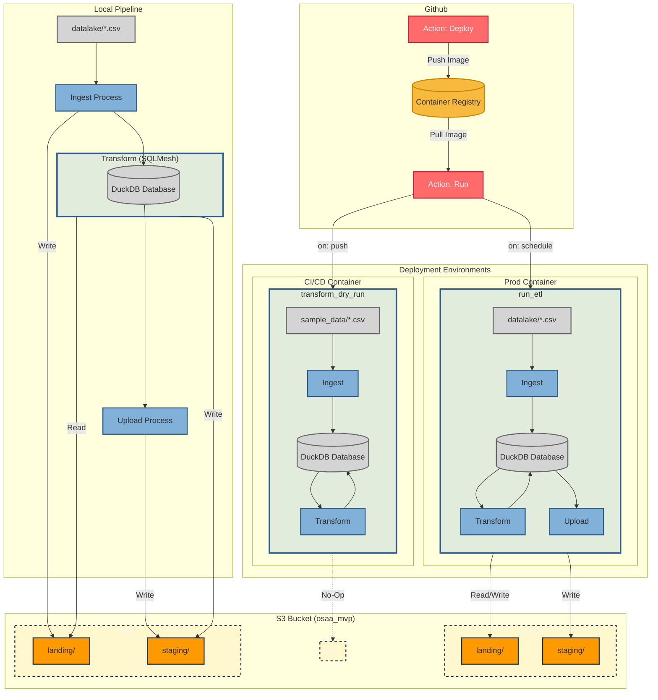

```mermaid
flowchart TB
    subgraph "Local Pipeline"
        direction LR
        DCSV[datalake/*.csv]
        DIP[Ingest Process]
        DUP[Upload Process]

        subgraph DTP["Transform (SQLMesh)"]
            direction TB
            DDB[(DuckDB Database)]
        end

        DCSV --> DIP
        DIP --> DDB
        DDB --> DUP
    end

subgraph "Github"
    direction TB
        PT[Action: Deploy]
        ST[Action: Run]

    GHCRDB[(Container Registry)]
end


    PT --> |Push Image| GHCRDB
    GHCRDB --> |Pull Image| ST
    ST -- "on: push" --> CICD
    ST -- "on: schedule" --> ETL

    subgraph "Deployment Environments"
        direction LR
        subgraph "CI/CD Container"
            direction LR
            subgraph CICD[transform_dry_run]
                direction TB
                ICSV[sample_data/*.csv]
                IDB[(DuckDB Database)]
                IIP[Ingest]
                ITP[Transform]
                ICSV --> IIP
                IIP --> IDB
                ITP --> IDB
                IDB --> ITP
            end
        end

        subgraph "Prod Container"
            direction LR
            subgraph ETL[run_etl]
                direction TB
                PCSV[datalake/*.csv]
                PDB[(DuckDB Database)]
                PIP[Ingest]
                PTP[Transform]
                PUP[Upload]
                PCSV --> PIP
                PIP --> PDB
                PTP --> PDB
                PDB --> PTP
                PDB --> PUP
            end
        end
    end

    subgraph "S3 Bucket (osaa_mvp)"
        direction LR
        subgraph PB[prod/]
            direction LR
            PL3[landing/]
            PT3[staging/]
        end
        subgraph IB[int/]
            direction LR

        end
        subgraph DB[dev/]
            direction LR
            DL3[landing/]
            DT3[staging/]
        end
    end

    %% Data Flow Connections
    DIP -- "Write" --> DL3
    DTP -- "Read" --> DL3
    DTP -- "Write" --> DT3
    DUP -- "Write" --> DT3
    ETL -- "Read/Write" --> PL3
    ETL -- "Write" --> PT3
    CICD -.-> |"No-Op"| IB

    classDef s3_folder fill:#ff9900,stroke:#232f3e,stroke-width:2px,color:#2d2d2d;
    classDef s3_bucket fill:#ff9900,stroke:#232f3e,stroke-width:2px,color:#f5f5f5, fill-opacity: 0.07, stroke-dasharray: 5 5;
    classDef process fill:#81b1d9,stroke:#2d5986,stroke-width:2px,color:#2d2d2d;
    classDef multi_process fill:#81b1d9,stroke:#2d5986,stroke-width:3px,color:#2d2d2d, fill-opacity: 0.24;
    classDef storage fill:#d4d4d4,stroke:#666666,stroke-width:2px,color:#2d2d2d;
    classDef action fill:#95c37d,stroke:#5a9c3c,stroke-width:2px,color:#2d2d2d;
    classDef registry fill:#f7b93e,stroke:#c78500,stroke-width:2px,color:#2d2d2d;
    classDef trigger fill:#ff6b6b,stroke:#c41e3a,stroke-width:2px,color:#f5f5f5;

    class DL3,DT3,PL3,PT3 s3_folder;
    class PB,IB,DB s3_bucket;
    class DIP,DUP,IIP,ITP,PIP,PTP,PUP,CICD,ETL process;
    class DTP,CICD,ETL multi_process;
    class DCSV,DDB,ICSV,IDB,PCSV,PDB storage;
    class GHCRDB registry;
    class PT,ST trigger;
```
